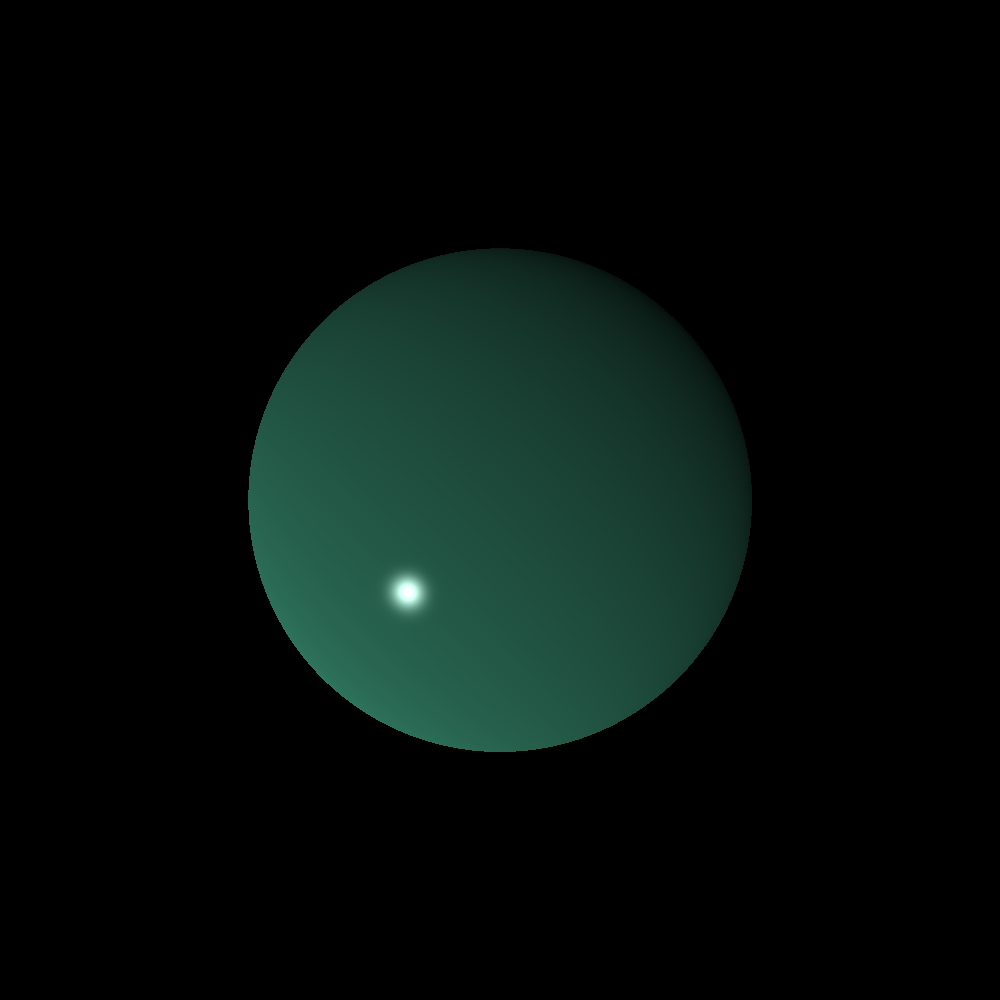

# The Ray Tracer Challenge

A compact, pedagogical C++ ray tracer intended as a step‑by‑step implementation of local illumination and basic rendering primitives. The project is designed as a minimal, auditable platform for experimenting with and extending core rendering concepts.

Intended functionality
- Per‑pixel ray casting from a pinhole camera through a projection plane (one ray per pixel).
- Analytic geometry and intersection tests (e.g., ray–sphere) with exact surface normal computation.
- Shading based on the Phong Reflection Model:
  - Ambient term (material ambient)
  - Diffuse term (Lambertian)
  - Specular term (Phong)
- Point light sources with RGB intensity and materials exposing color, ambient, diffuse, specular and shininess parameters.
- Portable image output in P3 PPM format (out.ppm), with colors clamped and scaled to the 0–255 range.
- A focused test suite for validating vector/matrix math and expected lighting behavior.

Build (short)
- Visual Studio 2022: create or open a C++ project, add the repository source and header files, set the language standard to C++20 or above, build and run. The executable writes out.ppm to the working directory.

Purpose and scope
This repository exists to teach and experiment with low‑level rendering building blocks (rays, intersections, normals, and local illumination). It emphasizes clarity, numerical correctness, and incremental extensibility (for example: shadows, recursive reflections, multiple primitives, transforms, and advanced lighting models).

The code in this repository is licensed under the MIT License - see LICENSE
